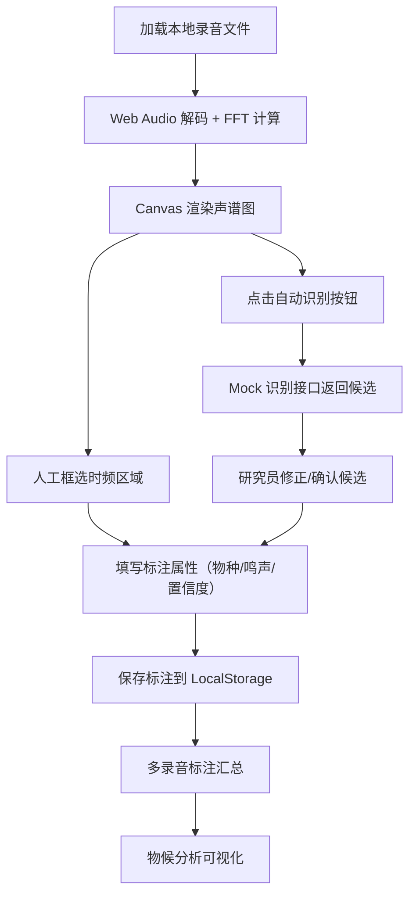

## 1. 产品概述

鸟类声纹标注与分析工作台，面向鸟类学研究员的纯前端工具，用于从野外被动声学记录仪采集的环境录音中识别鸟类鸣声，进行时频二维标注，进而分析候鸟迁徙物候。无需后端，所有数据存储于本地浏览器。

- 解决问题：野外海量声学数据的人工标注效率低、缺乏专业分析工具
- 目标用户：鸟类学研究员、生态监测人员
- 核心价值：提供专业的声谱可视化、高效的人机协同标注、直观的物候分析

## 2. 核心特性

### 2.1 功能模块
1. **声谱图工作台**：音频加载、Web Audio FFT 计算、Canvas 渲染声谱图
2. **时频标注系统**：二维框选交互、物种/鸣声类型/置信度打标、标注编辑
3. **自动识别接口**：预留 AI 模型接入点，当前用规则模拟返回候选结果
4. **物候分析仪表盘**：迁徙频次曲线、日节律图、物种丰富度季节变化
5. **数据管理**：本地存储、标注导入导出、录音文件管理

### 2.2 页面详情
| 页面名称 | 模块名称 | 功能描述 |
|---------|---------|---------|
| 标注工作台 | 音频控制栏 | 加载本地音频、播放/暂停、进度控制、音量调节 |
| 标注工作台 | 声谱图视图 | FFT 计算、Canvas 渲染、缩放/平移、颜色映射调节 |
| 标注工作台 | 标注工具栏 | 框选工具、标注列表、属性编辑、删除/确认操作 |
| 标注工作台 | 自动识别面板 | 触发识别、候选结果展示、一键转换为标注 |
| 物候分析 | 迁徙曲线 | 某物种全年各时段出现频次折线图 |
| 物候分析 | 日节律图 | 24 小时鸣声分布柱状图 |
| 物候分析 | 物种丰富度 | 各季节物种数量变化面积图 |
| 物候分析 | 数据筛选 | 按物种、日期范围、录音地点筛选 |
| 数据管理 | 录音列表 | 已加载录音文件管理、元数据编辑 |
| 数据管理 | 标注导入导出 | JSON 格式导入导出、批量操作 |

## 3. 核心流程

用户操作流程：
1. 研究员加载本地录音文件，系统自动计算并渲染声谱图
2. 在声谱图上观察鸟鸣特征，用鼠标框选时频区域
3. 填写标注信息（物种名称、鸣声类型、置信度）并保存
4. 或点击"自动识别"，系统返回模拟的候选鸟种和时间段
5. 研究员对自动结果进行修正确认，形成最终标注
6. 积累多次录音数据后，进入物候分析页面查看迁徙规律

## 4. 用户界面设计

### 4.1 设计风格
- **主色调**：深森林绿 #1B4332（专业、自然）
- **辅助色**：暖橙色 #D68C45（高亮、交互元素）
- **背景**：深灰 #0F172A（声谱图深色背景，减少视觉疲劳）
- **字体**：标题用 Cormorant Garamond（优雅学术感），正文用 Inter（清晰易读）
- **按钮风格**：圆角 6px，悬停微放大+阴影，点击有按压反馈
- **布局**：三栏式工作台，左侧工具栏、中间声谱图主区域、右侧标注面板
- **视觉元素**：微妙的网格纹理背景、柔和的投影、精准的间距节奏

### 4.2 页面设计概要
| 页面名称 | 模块名称 | UI 元素 |
|---------|---------|---------|
| 标注工作台 | 声谱图区域 | 深色 Canvas、坐标尺、时间轴、频率轴、可拖拽选框 |
| 标注工作台 | 标注属性面板 | 物种下拉框、鸣声类型单选组、置信度滑块、备注输入框 |
| 物候分析 | 图表区域 | ECharts 折线图/柱状图/面积图、交互式图例、时间筛选器 |
| 数据管理 | 文件列表 | 卡片式布局、文件缩略信息、悬停操作按钮 |

### 4.3 响应式设计
- 桌面端优先设计（最小支持 1280px 宽度）
- 三栏布局在小屏幕自动转为两栏或可折叠侧边栏
- 触摸设备支持双指缩放声谱图
- 所有交互元素确保 44px 最小点击区域

### 4.4 动效设计
- 页面加载：元素淡入+轻微上移，错落 100ms 延迟
- 声谱图渲染：从左到右渐进式绘制动画
- 选框交互：创建时边框呼吸动画，选中时高亮脉冲
- 按钮交互：悬停缩放 1.03，点击缩放 0.97，过渡 150ms
- 面板展开/收起：平滑高度过渡 + 淡入淡出
