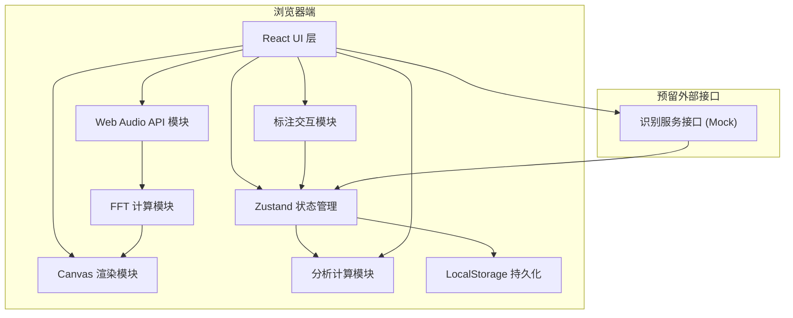
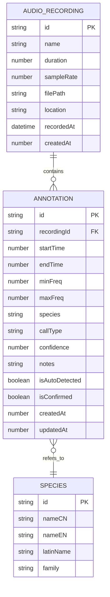

## 1. 架构设计



## 2. 技术栈说明

- **前端框架**：React@18 + TypeScript
- **构建工具**：Vite@5
- **样式方案**：TailwindCSS@3
- **状态管理**：Zustand@4
- **图表库**：ECharts@5
- **图标库**：Lucide React
- **音频处理**：Web Audio API (原生)
- **数据持久化**：LocalStorage (原生)
- **后端**：无，纯前端应用

## 3. 目录结构

```
src/
├── components/
│   ├── spectrogram/          # 声谱图相关组件
│   │   ├── SpectrogramCanvas.tsx    # 主画布组件
│   │   ├── SpectrogramControls.tsx  # 控制面板
│   │   └── SelectionOverlay.tsx     # 选框覆盖层
│   ├── annotation/           # 标注相关组件
│   │   ├── AnnotationPanel.tsx      # 标注属性面板
│   │   ├── AnnotationList.tsx       # 标注列表
│   │   └── AutoRecognition.tsx      # 自动识别面板
│   ├── analysis/             # 分析图表组件
│   │   ├── MigrationChart.tsx       # 迁徙曲线
│   │   ├── DailyRhythmChart.tsx     # 日节律图
│   │   └── SpeciesRichnessChart.tsx # 物种丰富度
│   ├── audio/                # 音频控制组件
│   │   ├── AudioPlayer.tsx          # 音频播放器
│   │   └── FileUploader.tsx         # 文件上传
│   └── layout/               # 布局组件
│       ├── Sidebar.tsx              # 侧边栏
│       └── Header.tsx               # 顶部导航
├── hooks/
│   ├── useAudioContext.ts    # 音频上下文 Hook
│   ├── useFFT.ts             # FFT 计算 Hook
│   ├── useSpectrogram.ts     # 声谱图 Hook
│   └── useLocalStorage.ts    # 本地存储 Hook
├── store/
│   ├── audioStore.ts         # 音频状态
│   ├── annotationStore.ts    # 标注状态
│   └── uiStore.ts            # UI 状态
├── types/
│   ├── audio.ts              # 音频相关类型
│   ├── annotation.ts         # 标注相关类型
│   └── analysis.ts           # 分析相关类型
├── utils/
│   ├── fft.ts                # FFT 算法
│   ├── colorMap.ts           # 颜色映射表
│   ├── analysis.ts           # 分析计算工具
│   └── storage.ts            # 存储工具
├── services/
│   └── recognition.ts        # 识别服务 (Mock)
├── pages/
│   ├── Workbench.tsx         # 标注工作台
│   ├── Analysis.tsx          # 物候分析
│   └── DataManagement.tsx    # 数据管理
├── App.tsx
└── main.tsx
```

## 4. 路由定义

| 路由 | 页面 | 说明 |
|------|------|------|
| / | Workbench | 标注工作台（首页） |
| /analysis | Analysis | 物候分析页面 |
| /data | DataManagement | 数据管理页面 |

## 5. 核心数据模型

### 5.1 数据模型定义



### 5.2 类型定义

```typescript
// 音频录音
interface AudioRecording {
  id: string;
  name: string;
  duration: number; // 秒
  sampleRate: number;
  filePath?: string;
  location?: string;
  recordedAt?: string; // ISO datetime
  createdAt: number;
  audioBuffer?: AudioBuffer; // 运行时存储
}

// 标注 - 二维时频区域
interface Annotation {
  id: string;
  recordingId: string;
  startTime: number; // 秒
  endTime: number; // 秒
  minFreq: number; // Hz
  maxFreq: number; // Hz
  species: string;
  callType: 'song' | 'call' | 'alarm' | 'courtship' | 'unknown';
  confidence: number; // 0-1
  notes?: string;
  isAutoDetected: boolean;
  isConfirmed: boolean;
  createdAt: number;
  updatedAt: number;
}

// 自动识别候选结果
interface RecognitionCandidate {
  id: string;
  startTime: number;
  endTime: number;
  minFreq: number;
  maxFreq: number;
  species: string;
  callType: string;
  confidence: number;
}

// 识别服务接口
interface RecognitionService {
  analyze(audioBuffer: AudioBuffer): Promise<RecognitionCandidate[]>;
}

// 物候分析数据
interface MigrationDataPoint {
  date: string;
  species: string;
  count: number;
}

interface DailyRhythmDataPoint {
  hour: number;
  species: string;
  count: number;
}

interface SpeciesRichnessDataPoint {
  month: number;
  speciesCount: number;
  totalAnnotations: number;
}
```

## 6. 核心技术实现方案

### 6.1 FFT 声谱图计算

使用 Web Audio API 的 `AnalyserNode` 或自定义 FFT 算法：
- FFT 大小：2048 或 4096（根据性能可调）
- 窗函数：Hann 窗（减少频谱泄漏）
- 重叠率：50%-75%（时间分辨率与频率分辨率的权衡）
- 频率范围：0-12kHz（覆盖大多数鸟类鸣声）
- 颜色映射：Viridis 或 Magma 色系，对数强度显示

### 6.2 声谱图渲染

使用 Canvas 2D API：
- 创建 OffscreenCanvas 进行离屏渲染
- 将 FFT 结果映射为像素颜色
- 支持缩放（时间轴/频率轴独立缩放）
- 支持平移拖拽
- 坐标转换：像素坐标 ↔ 时间/频率

### 6.3 二维标注交互

- 鼠标按下记录起点，拖拽创建选框
- 选框支持调整大小（8 个方向控制点）
- 选框支持移动
- 支持多选、删除操作
- 选框数据模型：{x, y, width, height} 像素坐标 ↔ {startTime, endTime, minFreq, maxFreq} 时频坐标

### 6.4 状态管理设计

```typescript
// 音频状态
interface AudioState {
  recordings: AudioRecording[];
  currentRecordingId: string | null;
  isPlaying: boolean;
  currentTime: number;
  volume: number;
  setCurrentRecording: (id: string) => void;
  addRecording: (recording: AudioRecording) => void;
  removeRecording: (id: string) => void;
}

// 标注状态
interface AnnotationState {
  annotations: Annotation[];
  selectedAnnotationId: string | null;
  isDrawingSelection: boolean;
  currentSelection: Selection | null;
  addAnnotation: (annotation: Omit<Annotation, 'id' | 'createdAt' | 'updatedAt'>) => void;
  updateAnnotation: (id: string, updates: Partial<Annotation>) => void;
  deleteAnnotation: (id: string) => void;
  confirmAnnotation: (id: string) => void;
}
```

### 6.5 自动识别接口预留

```typescript
// services/recognition.ts
export interface RecognitionService {
  analyze(audioBuffer: AudioBuffer): Promise<RecognitionCandidate[]>;
}

// Mock 实现
export class MockRecognitionService implements RecognitionService {
  async analyze(audioBuffer: AudioBuffer): Promise<RecognitionCandidate[]> {
    // 规则模拟：基于能量阈值检测鸣声片段
    // 随机分配常见鸟种
    return this.generateMockResults(audioBuffer.duration);
  }
  
  private generateMockResults(duration: number): RecognitionCandidate[] {
    // 生成 3-8 个模拟候选
    const count = Math.floor(Math.random() * 6) + 3;
    const species = ['画眉', '喜鹊', '麻雀', '杜鹃', '夜莺', '黄鹂'];
    const callTypes = ['song', 'call', 'alarm'];
    
    return Array.from({ length: count }, (_, i) => ({
      id: `mock-${i}`,
      startTime: Math.random() * (duration - 2),
      endTime: Math.min(duration, startTime + 0.5 + Math.random() * 2),
      minFreq: 1000 + Math.random() * 2000,
      maxFreq: 4000 + Math.random() * 4000,
      species: species[Math.floor(Math.random() * species.length)],
      callType: callTypes[Math.floor(Math.random() * callTypes.length)],
      confidence: 0.6 + Math.random() * 0.35,
    }));
  }
}

// 真实接口预留
export class APIRecognitionService implements RecognitionService {
  async analyze(audioBuffer: AudioBuffer): Promise<RecognitionCandidate[]> {
    // TODO: 调用后端识别 API
    // const formData = new FormData();
    // formData.append('audio', audioBufferToWav(audioBuffer));
    // return fetch('/api/recognize', { method: 'POST', body: formData }).then(r => r.json());
    throw new Error('Not implemented');
  }
}
```

## 7. 性能优化策略

1. **FFT 计算**：使用 Web Worker 进行离线计算，避免阻塞 UI
2. **声谱图渲染**：分层渲染，仅重绘变化区域；使用 requestAnimationFrame 节流
3. **大数据量**：标注数据分页渲染；Canvas 视口裁剪
4. **内存管理**：AudioBuffer 手动释放；避免闭包内存泄漏
5. **LocalStorage**：数据压缩存储；定期清理过期数据
